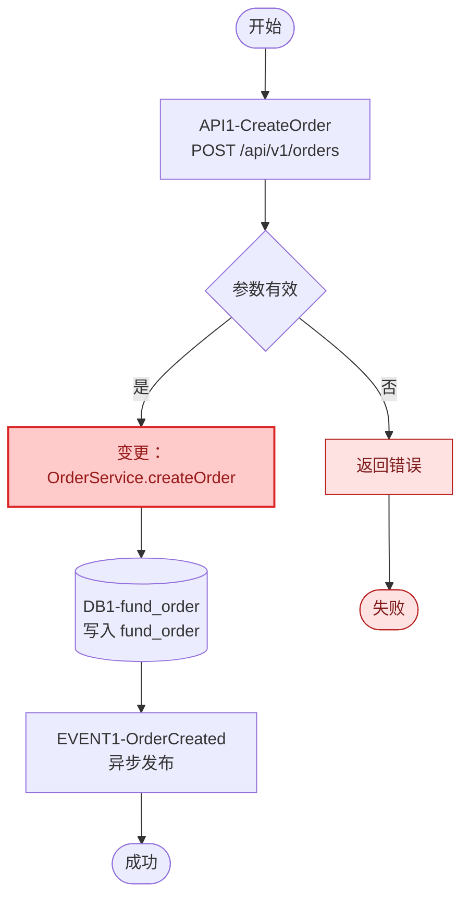
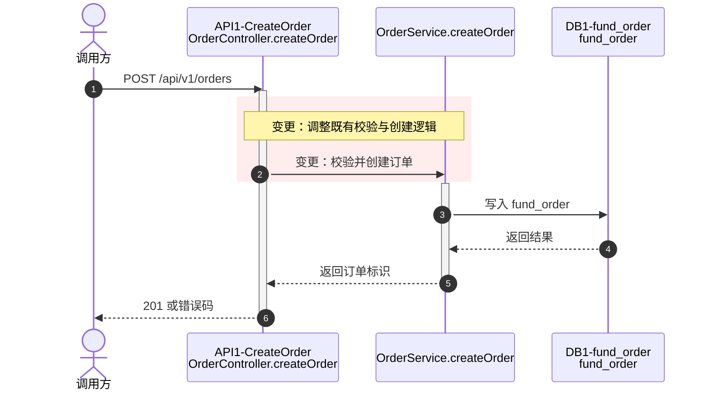

# 编码详细设计模板

## 轻量模板（默认使用）

> 评审顺序固定为：实现清单 → 接口/任务主逻辑 → 数据表关系 → 关键约束。除非某项会改变编码、测试或上线方案，否则不展开。

存量逻辑调整规则：正文写成 `**变更：具体内容**`；流程图使用 `changed` 红色语义类；时序图用淡红色 `rect` 包裹变更消息。纯新增逻辑保持普通样式。

### 1. 实现清单

| 全局引用 | 类型 | 关键入口 | 主要数据/事件 |
|---|---|---|---|
| API1-CreateOrder | 接口 | `POST /api/v1/orders`；`OrderController.createOrder` | DB1-fund_order、EVENT1-OrderCreated |
| JOB1-SmokeTask | 任务 | `SmokeTask.execute` | DB1-fund_order、EVENT2-SmokeCompleted |

### 2. 接口/任务主逻辑

每个接口或任务只保留以下内容：入口边界、Mermaid 流程图、Mermaid 时序图、3-7 步交互序列、成功/失败出口。





交互步骤：

1. **变更：`OrderController.createOrder` 增加输入校验。**
2. `OrderService.createOrder` 写入 `fund_order.user_id/order_status`。
3. 返回订单标识；失败时返回明确错误码。

任务单元沿用相同结构，并把入口改为任务类名/方法；流程必须显示触发、扫描或消费、处理、重试上限、最终失败和告警出口。

### 3. 数据表关系

| 全局引用 | 表/集合 | 所属模块 | 读方 | 写方 | 关系/关联键 |
|---|---|---|---|---|---|
| DB1-fund_order | `fund_order` |  |  |  |  |

同表多字段写成 `fund_order.user_id/order_status`；不同表分别写完整表名。字段定义需要逐字段核对时，再增加字段表。

### 4. 关键约束

| 类别 | 只填写会改变实现的内容 |
|---|---|
| 安全 | 认证、授权、隔离、敏感信息 |
| 异常/一致性 | 错误出口、幂等、事务、重试、补偿 |
| 日志 | 关键事件、级别、`traceId`/业务主键、脱敏 |
| 性能 | 规模、并发、P95/吞吐目标、瓶颈、验证方式 |

表格中的存量改动只加粗发生变化的单元格文字，例如 `**变更：幂等键由 requestId 调整为 orderId**`。

## 5. 待确认与汇总

只列影响实现、测试、容量或上线的未决问题，并说明影响范围。

```text
接口：N 个；任务：N 个；数据表/集合：N 个；事件：N 个；日志：N 项。
```
