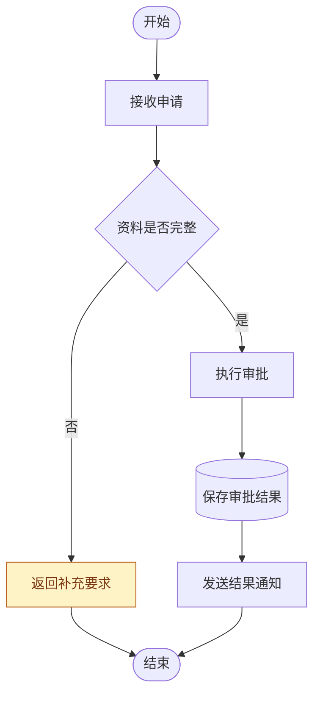

# Mermaid 流程图

## 触发边界

- 只有用户明确写出 `$mermaid-flowchart` 时使用本技能。
- 用户只说“画 Mermaid 流程图”“把过程画成图”或“检查流程图”但未指定本技能时，不使用本技能。
- 显式触发后，仍需遵循下方的建模、绘制和渲染校验规范。

## 目标

把自然语言、需求、代码或运行手册整理为有明确入口、处理步骤、判断条件、循环和出口的 Mermaid 流程图。优先交付可直接放入 Markdown 或 Mermaid 编辑器的源码；需要时补充边界说明、假设和验证结果。

## 创建思路

按以下顺序建模，不要先堆节点再尝试连线：

1. **确定目标**：一句话说明这张图回答什么问题，并划定开始、结束和不在范围内的内容。
2. **提取步骤**：从输入中识别动作、判断、数据、外部系统、子流程、重试和人工节点。
3. **统一粒度**：同一层级只表达相近粒度的动作；不要把“提交申请”和“数据库字段校验”混在同一主流程层级。
4. **先画主路径**：从开始到成功结束画出最短闭环，再加入失败、取消、超时、重试和补偿分支。
5. **选择方向**：业务流程默认使用 `flowchart TB`；横向管道、数据流或阶段链路可使用 `flowchart LR`。
6. **建立边界**：仅在确有系统、职责、阶段或事务边界时使用 `subgraph`，不要把每组两三个节点都装进子图。
7. **压缩与校验**：消除交叉线、重复节点、无标签判断边和死路；复杂图拆成总览图和局部图。

## 标准工作流

### 1. 收集输入和假设

- 读取需求、代码、接口文档、SOP、日志或现有 Mermaid 源码。
- 明确流程发起者、输入、成功结果、失败结果、循环退出条件和责任边界。
- 缺失信息用图外说明或注释标为“假设”，不要把推测画成确定事实。

### 2. 建立节点清单

- 为每个节点分配稳定、简短的 ASCII ID，例如 `Start`、`Validate`、`Persist`；显示名称可以使用中文。
- 开始和结束使用体育场形节点：`Start([开始])`、`Done([结束])`。
- 普通处理使用矩形节点：`Validate[校验资料]`。
- 判断使用菱形节点：`Check{资料是否完整}`，文字写成能由分支直接回答的问题。
- 数据库或持久化存储使用圆柱节点：`DB[(订单库)]`；可复用子流程使用 `Subprocess[[执行风控]]`。
- 一个节点只表达一个动作或状态；动作节点优先使用“动词 + 对象”。

### 3. 连接主路径和分支

- 普通流程使用 `-->`；判断分支使用 `-->|条件|`。
- 判断节点的每条出边都必须标注条件，条件互斥且覆盖预期结果；不要只标“是”而让另一条边依靠猜测。
- 主成功路径保持笔直，异常或补偿路径向侧面展开，并明确返回主流程还是直接结束。
- 循环必须标明继续条件和退出条件；重试同时标注最大次数或终止策略。
- 虚线和粗线只有在图例定义了明确语义时使用，不要单纯为了装饰改变线型。

### 4. 组织布局和边界

- 参与频繁或顺序紧密的节点放在相邻区域，减少长距离回边和交叉线。
- `subgraph` 只表达真实边界，标题使用业务名称；需要时在子图内部设置 `direction TB` 或 `direction LR`。
- 同一节点不要重复声明来模拟跨区域复用；通过连线引用同一个稳定 ID。
- 超过约 15 个节点、三层判断嵌套或三个主要边界时，优先拆成总览图与局部图。

## 绘制规范（重点）

### 节点规范

- 节点 ID 使用字母、数字和下划线，不使用中文、空格或 Mermaid 保留字；避免小写 `end`。
- 节点形状承载稳定语义：起止、处理、判断、存储、子流程在同一套图中保持一致。
- 节点文本控制在一个动作或一个问题；较长说明移到图外，不在节点中塞入段落。
- 同一业务对象使用同一名称，避免“申请单”“请求”“工单”无说明地混用。

### 连线和判断规范

- 连线方向代表真实流程先后，不为排版反向表达业务。
- 默认禁止可避免的连线交叉。交付前依次尝试调整节点声明顺序、切换 `TB` / `LR`、移动分支位置、收敛边界入口以及拆分复杂图。
- 不得通过反转真实流程方向、重复声明同一业务节点、删除必要连线或合并不同业务状态来换取无交叉布局。
- 保持业务语义、节点唯一性和真实方向后仍无法消除的交叉可以保留，但必须在图外说明涉及的连线、不可消除原因和已经尝试的布局方案。
- 单处不可避免交叉只有在不遮挡节点、箭头和条件标签时才允许；多处不可避免交叉或任何交叉造成阅读歧义时必须拆图。
- 一个处理节点通常只有一个正常出口；多个出口存在业务条件时改用判断节点。
- 判断条件写在出边而不是下一节点中；推荐 `-->|有效|`、`-->|无效|` 或明确的条件表达式。
- 汇合多个分支时，确认它们确实进入同一状态；不同数据状态不要为了减少节点而强行合并。
- 禁止悬空边、无法到达的节点和没有结束/回路的死路，除非图外明确说明这是持续运行过程。

### 子图、样式和兼容性规范

- 使用 `subgraph Id[标题]` 声明边界，ID 保持稳定；不要只写标题后依赖自动 ID。
- 子图方向可能受跨子图连线影响；目标渲染器布局不稳定时，优先简化跨边界连线或拆图。
- 样式优先使用少量 `classDef` 和语义类，不为每个节点写独立颜色；颜色不能成为唯一的信息载体。
- 异常、失败或终止节点必须使用 `exception` 红色语义类；兜底、降级或重试节点必须使用 `fallback` 黄色语义类。固定定义为 `classDef exception fill:#fee2e2,stroke:#b91c1c,color:#7f1d1d` 和 `classDef fallback fill:#fef3c7,stroke:#b45309,color:#78350f`。
- 颜色由节点的最终处理语义决定：重试或降级仍可继续处理时用 `fallback`；重试耗尽、抛错或直接终止时用 `exception`。节点文字和判断边仍必须明确写出异常或兜底含义。
- 两个及以上并列区域或嵌套 `subgraph` 必须视觉区分；嵌套 `subgraph` 的每一层必须使用独立的语义类和不同色值，并在标题中标出 `L1`、`L2`、`L3`。超过三层时必须拆图。
- 使用 HTML 标签、新形状语法或点击链接前确认目标 Mermaid 版本支持；默认采用兼容性更好的基础语法。

## 可直接复用的模板

## 渲染校验策略

交付前不得只凭源码检查就声称“可渲染”，按以下顺序验证：

1. 优先运行项目已有的 Mermaid 渲染器、文档构建或图例测试，并保留失败信息。
2. 项目没有专用校验时，运行 `python3 <技能目录>/scripts/validate_examples.py <Markdown或.mmd文件>`；脚本在环境已有 `mmdc` 时实际渲染每个流程图，否则只执行静态检查。
3. 必须完成实际渲染时增加 `--require-render`；没有 `mmdc` 时让校验失败，不要为了验证而修改项目依赖。
4. 只有静态检查可用时，明确报告“未渲染验证”，不得把静态检查描述成渲染通过。

渲染失败时，先保留原始源码，再最小化为图类型、两个节点和一条边，逐段恢复子图、条件、样式和特殊字符以定位问题。

## 交付前检查

- [ ] 代码块标记为 `mermaid`，第一条有效语句是 `flowchart TB` 或明确选择的其他方向。
- [ ] 开始、处理、判断、存储、子流程和结束使用一致的节点形状。
- [ ] 每个判断出口都有互斥且完整的条件标签。
- [ ] 不存在可避免的连线交叉；允许保留的单处交叉已有原因和尝试方案说明，且不遮挡节点、箭头或标签。
- [ ] 主路径闭环；异常、取消、超时和重试均有明确去向。
- [ ] 异常/失败/终止节点使用 `exception` 红色语义类；兜底/降级/重试节点使用 `fallback` 黄色语义类；重试耗尽已转为红色。
- [ ] 多个并列区域和嵌套 `subgraph` 已使用独立语义类与不同色值区分；嵌套不超过三层。
- [ ] 没有悬空边、不可达节点、无说明死路或依赖颜色才能识别的含义。
- [ ] 子图表达真实边界，跨边界连线尽量少，方向设置符合目标渲染器行为。
- [ ] 复杂度超过可读范围时已经拆图，并沿用相同 ID、术语和边界名称。
- [ ] 已按“渲染校验策略”验证；无法实际渲染时明确标记“未渲染验证”。
- [ ] 未确认的信息已标为假设，没有伪装成事实。

## 参考资料

需要查询节点形状、连线、子图、样式和兼容性示例时，读取 [references/mermaid-syntax.md](references/mermaid-syntax.md)。
