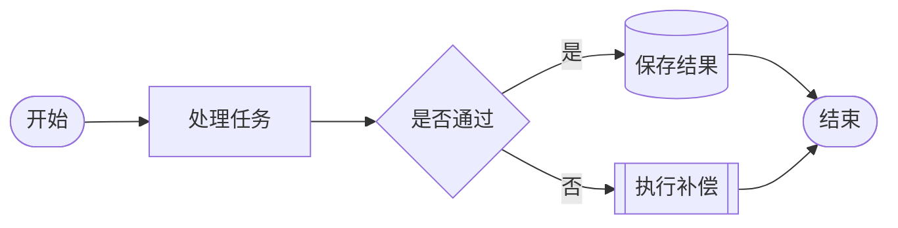
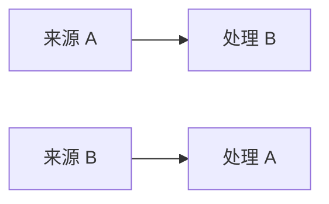
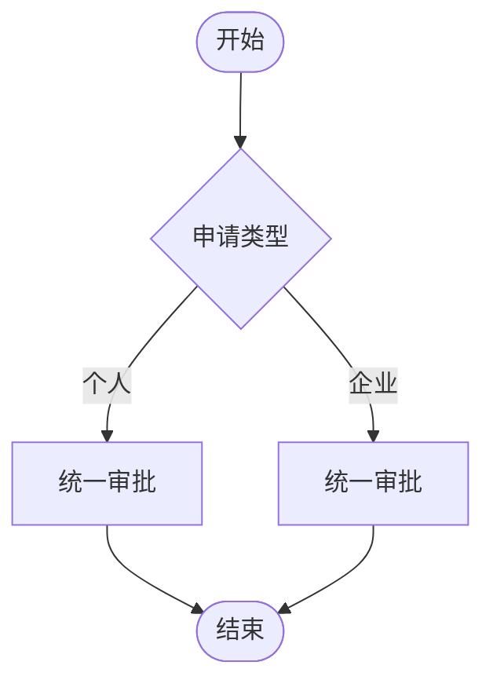
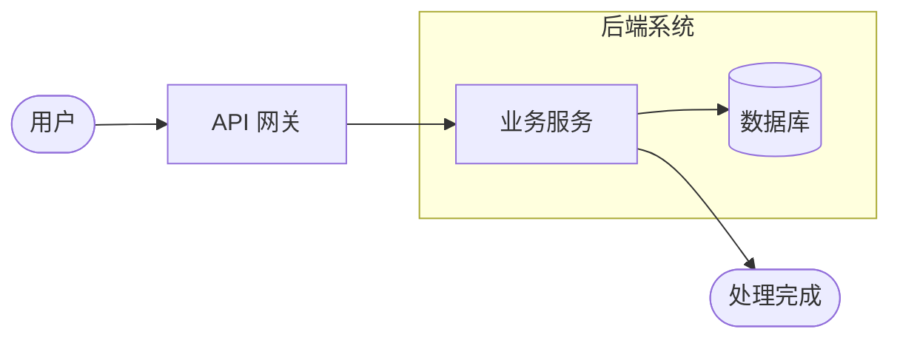
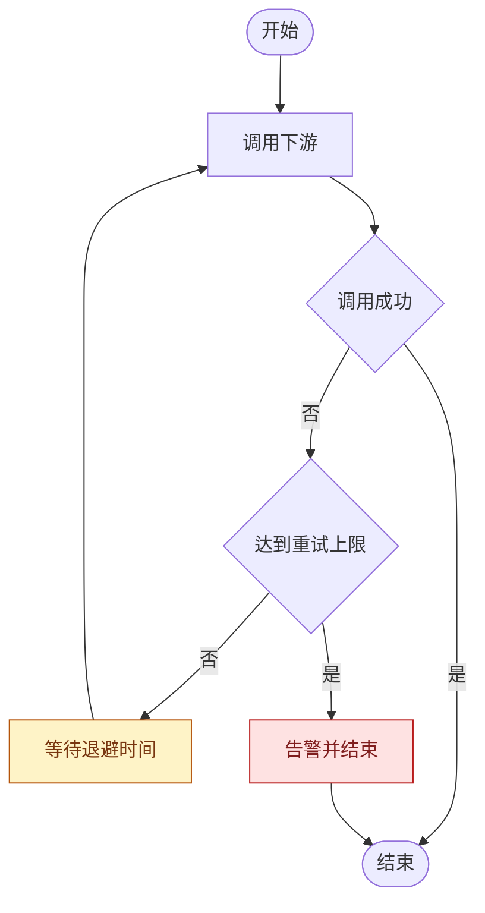
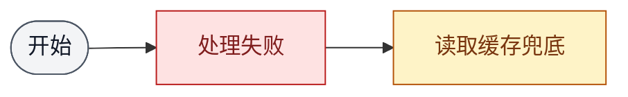
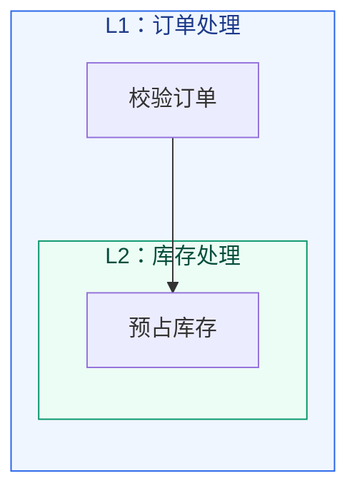

# Mermaid 流程图语法参考

## 方向

| 声明 | 适用场景 |
| --- | --- |
| `flowchart TB` | 默认业务流程、审批过程、故障处置 |
| `flowchart LR` | 管道、数据流、阶段链路、系统处理链 |
| `flowchart BT` | 明确需要自下而上的流程 |
| `flowchart RL` | 明确需要从右向左的流程 |

同一张图只设置一个顶层方向。`graph` 是兼容别名，新图优先使用语义更清楚的 `flowchart`。

## 常用节点

| 写法 | 语义 |
| --- | --- |
| `A([开始])` | 开始或结束 |
| `A[处理]` | 普通动作或状态 |
| `A{条件}` | 判断或分支 |
| `A[(数据库)]` | 数据库或持久化存储 |
| `A[[子流程]]` | 已定义的子流程 |
| `A((连接点))` | 连接点，谨慎使用 |

节点 ID 使用稳定的 ASCII 标识；标签包含括号、冒号或其他特殊字符时使用引号，例如 `Call["调用 foo()"]`。

## 连线

| 写法 | 语义 |
| --- | --- |
| `A --> B` | 默认流程 |
| `A -->|条件| B` | 带条件的流程 |
| `A -.-> B` | 虚线关系，必须在图例中说明 |
| `A ==> B` | 强调关系，少量使用 |
| `A --- B` | 无箭头关联，不用于有先后的业务流程 |

判断节点的所有出边都写条件。条件较长时压缩为关键表达式，把详细规则放在图外说明。

## 连线交叉

先以目标 Mermaid 版本实际渲染，再判断是否交叉；不能仅凭源码顺序断言最终线形。发现交叉后依次调整节点声明顺序、图方向、分支位置和边界入口，必要时拆图。不得改变业务方向或复制业务节点来掩盖交叉。

### 错误示例：可避免的交叉

下例把两个目标按与连线相反的顺序声明，容易形成 `SourceA -> TargetB` 与 `SourceB -> TargetA` 的交叉：

### 改正示例：调整分支位置

保持连线及业务语义不变，只调整目标节点的声明顺序，使相连节点尽量处于同一视觉通道：

自动布局器仍可能重新排序节点，因此必须以实际渲染结果验收；若交叉仍存在，继续调整方向或拆图。

### 错误示例：通过复制节点掩盖交叉

下例把同一个“统一审批”复制成两个节点。即使视觉上减少交叉，也错误表达为两个独立业务步骤：

正确做法是只保留一个稳定 ID，例如两条分支都连接 `Review[统一审批]`；若因此产生且无法消除单处交叉，应保留真实语义并在图外说明，而不是复制节点。

## 子图和内部方向

`subgraph Id[标题]` 的 ID 和标题分开维护。子图中的 `direction TB` 可能在节点连接到子图外部时被布局引擎忽略；此时减少跨边界连线，或把局部流程拆成独立图。

## 循环和重试

回边必须进入明确的重试起点，并同时展示成功出口和终止出口。不要用无标签回边表达无限循环。

## 样式

样式只补充语义，不替代形状、文字和连线标签。异常、失败、终止统一使用 `exception`，兜底、降级、重试统一使用 `fallback`；重试耗尽后的终止节点改用 `exception`。固定色值便于校验器检查，且文字必须独立表达语义。

## 多区域与嵌套子图

同一图中有两个及以上并列区域时，各区域使用不同语义类；发生嵌套时，每层使用独立类和 `L1`、`L2`、`L3` 标题。颜色只帮助定位层级，区域标题和节点连线必须在无颜色时仍可理解。超过三层时拆图。

## 常见渲染问题

- 小写 `end` 可能被解析为子图结束：节点 ID 改为 `End`、`Done` 或其他非保留字。
- 标签包含括号等特殊字符时解析失败：使用 `A["显示文字"]` 包裹标签。
- 节点 ID 以 `o` 或 `x` 紧跟在连线后可能改变箭头形状：在连线和节点 ID 之间保留空格。
- `subgraph` 缺少 `end`：按缩进逐个配对。
- 子图内部方向没有生效：检查该子图节点是否直接连接外部节点，并简化跨边界连线。
- 目标平台版本较旧：优先使用 `flowchart TB/LR`、基础节点、`-->`、`subgraph` 和 `classDef`。
