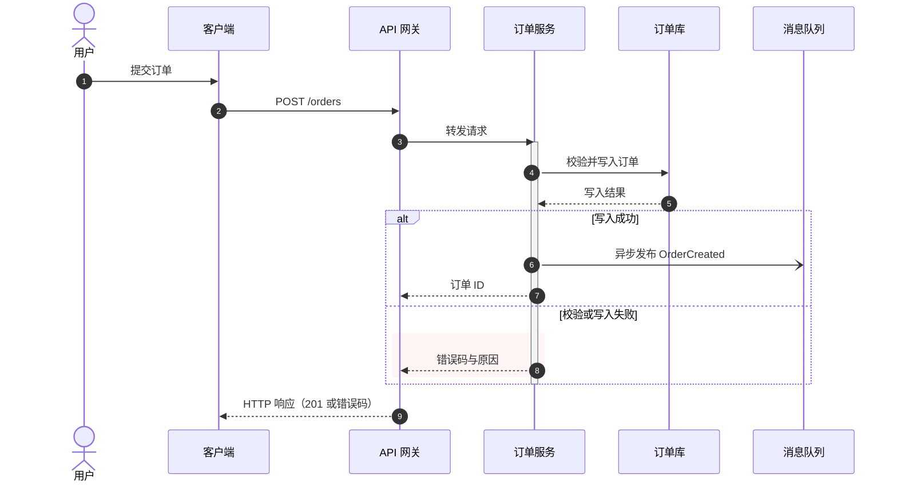

# Mermaid 时序图

## 触发边界

- 只有用户明确写出 `$mermaid-sequence-diagram` 时使用本技能。
- 用户只说“画 Mermaid 时序图”“把流程转成时序图”或“检查时序图”但未指定本技能时，不使用本技能。
- 显式触发后，仍需遵循下方的建模、绘制和渲染校验规范。

## 目标

将自然语言或代码中的交互过程整理成“谁在什么时间，以什么方式，向谁发送什么消息，并得到什么结果”的时序图。交付物优先是可直接粘贴到 Mermaid 编辑器、Markdown、文档或代码注释中的 Mermaid 源码；需要时再附参与者说明、假设和校验结果。

## 创建思路

按以下顺序建模，不要一上来就写箭头：

1. **划定边界**：明确开始事件、结束条件、正常路径和需要保留的异常/超时路径；删除与问题无关的内部实现细节。
2. **识别参与者**：从调用关系中提取用户、客户端、网关、服务、数据库、消息队列、第三方系统和定时器。一个参与者代表一个可独立发送或接收消息的角色，避免把类、方法、字段堆成参与者。
3. **确定时序粒度**：以一次请求、一次任务或一次业务协作为主线。同步调用、异步投递、回调、轮询和返回要能区分；同一层级的消息保持相近粒度。
4. **排列参与者**：按“触发者 → 入口 → 核心服务 → 数据/基础设施 → 外部系统”的调用方向排列；让最常交互的角色相邻，减少交叉线。
5. **先画主路径**：先写从开始到成功结束的最短闭环，再加入 `alt`、`opt`、`loop`、`par`、超时和补偿分支。
6. **补充语义**：为关键消息标注协议/动作、关键参数或结果；用激活条、返回箭头、注释和分组说明状态变化，不在图中塞入大段业务规则。
7. **校验可读性**：检查参与者是否可辨认、箭头方向是否正确、编号/命名是否一致、分支是否闭合、源码是否能渲染；复杂图应拆成总览图和局部图。

## 标准工作流

### 1. 收集输入和假设

- 读取用户提供的需求、接口文档、代码、日志或现有 Mermaid 源码。
- 明确时区、重试次数、幂等、超时、最终一致性等会改变时序的约束；缺失信息用 `Note over ...: 假设：...` 标出，不要悄悄臆测。
- 若用户只给出一句话，先采用最小可用模型，并在图后列出待确认点。

### 2. 选择图的结构

- 默认使用 `sequenceDiagram`，第一行必须是图类型声明。
- 默认使用 `participant` 表示系统参与者；需要显示人形角色时使用 `actor`；使用 `box` 表达系统边界；为长名称设置短别名。
- 使用 `box` 按边界分组，但不要让一个参与者同时出现在多个 `box` 中。
- 所有完整时序图必须启用 `autonumber`，且第二条有效语句必须是 `autonumber`；空行和 `%%` 注释不计入有效语句。
- 禁止在消息文本中手写序号代替自动编号；`alt`、`loop`、`par` 等区域沿用全图连续编号，不要求分支重新编号。

### 3. 编写主流程

使用简洁、动词开头的消息文本，例如 `POST /orders`、`校验令牌`、`写入订单`、`发布 OrderCreated`。同步调用用实线箭头，返回用虚线箭头；异步消息用开放箭头，并明确“投递/消费/回调”语义。推荐先写源码，再用渲染器或项目文档预览。

### 4. 表达分支和并行

- `alt`：互斥且至少有两个结果（成功/失败、命中/未命中）。每个分支写清条件。
- `opt`：可选步骤，只有一个条件分支；不要用 `alt` 伪造单分支。
- `loop`：重试、批量、轮询等重复过程，标明次数或退出条件。
- `par`：真正同时发生且相互独立的活动；若存在先后依赖，拆回普通时序。
- `critical` / `break`：仅在需要表达关键区或提前终止主流程时使用，并说明触发条件。
- 分支应尽量在产生决策的参与者附近开始，在同一层级结束；不要让一条箭头跨越多个未闭合分支。

## 绘制规范（重点）

### 参与者规范

- 名称统一使用业务角色或系统名，避免同时出现“订单服务”“OrderService”“订单 Service”三种写法。
- 别名只解决长名称，不隐藏真实语义：`participant API as API 网关`。
- 参与者顺序体现调用方向；同一层级按实际调用频率或主流程顺序排列。
- 数据库、缓存、队列、第三方支付等基础设施单独列出；不要把“数据库查询”画成服务自身的内部动作。
- 人、用户或外部业务角色使用 `actor`；系统、服务、队列和存储使用 `participant`；系统边界使用 `box`。

### 消息和箭头规范

- 消息格式保持一致：`发送方->>接收方: 动作 [协议/关键数据]`。
- 同步请求优先 `->>`，同步返回优先 `-->>`；异步投递推荐使用 `-)` 或 `--)`，并在文字中写明异步。目标渲染器不支持开放箭头时，使用兼容箭头并在消息文本中明确“异步投递”；`-x` / `--x` 仅表达消息丢失或失败。
- 返回箭头应回到发起者，且只返回关键结果（状态、标识、错误码）；不要重复整段请求体。
- 每条消息只表达一个动作；拆分“校验并写库并发消息”这类复合句。
- 方向必须能从业务事实推导：谁真正发起、谁真正处理、谁最终响应，不能为了排版反向画箭头。
- 消息文本避免换行、尖括号和过长句子；需要解释时使用 `Note`。

### 激活、状态与注释规范

- 对耗时或有嵌套调用的处理使用 `activate` / `deactivate`；成对出现，避免激活条覆盖无关步骤。
- 用 `Note right of`、`Note left of` 或 `Note over` 记录前置条件、数据状态、幂等键、超时和假设；注释不替代业务消息。
- 用 `rect` 高亮关键阶段（如事务、补偿、人工介入），并保持颜色语义稳定；没有明确视觉需求时少用颜色。
- 用 `link`、HTML 或复杂样式前先确认目标渲染器支持；以 Mermaid 标准语法和纯文本可读性为优先。

### 区域块与嵌套规范

- 逻辑区域块包括 `alt`、`opt`、`loop`、`par`、`critical` 和 `break`；`rect` 负责视觉分区，`box` 只负责参与者/系统边界，不能代替逻辑区域的层级区分。
- 单个且不嵌套的逻辑区域块可以不加颜色；同一张图出现两个及以上逻辑区域块时，每个块必须使用独立的 `rect` 包裹，并通过标题和低饱和度背景色区分。
- 只要逻辑区域块发生嵌套，每一层必须使用独立的 `rect`，相邻层和同级块颜色不得重复；不能用一个外层 `rect` 同时代表多个逻辑层级。
- 嵌套块标题使用 `L1`、`L2`、`L3` 加判断对象、次数或动作，例如 `alt L1：令牌有效`、`loop L2：最多重试 3 次`；同级非嵌套块使用明确且互不重复的业务标题。
- 外层到内层使用可辨认但柔和的色阶，透明度建议保持在 `0.25–0.40`；颜色只辅助定位，块类型、标题和分支条件必须脱离颜色仍可理解。
- 颜色含义在同一套图中保持稳定：同一语义使用同一色系，并通过明度或透明度区分不同块；同一张图内不得复用完全相同的色值。例如蓝色表示正常判断、绿色表示继续处理、黄色表示重试/降级、红色表示失败/终止。
- 异常、失败或终止分支必须使用红色系 `rect`，并在该 `rect` 前紧邻写 `%% semantic:exception`；兜底、降级或重试分支必须使用黄色系 `rect`，并在该 `rect` 前紧邻写 `%% semantic:fallback`。标记供校验器识别，不改变渲染结果。
- 红色系按嵌套深度选用 `rgba(254, 226, 226, 0.25–0.40)`、`rgba(254, 202, 202, 0.25–0.40)`、`rgba(254, 178, 178, 0.25–0.40)`；黄色系对应选用 `rgba(254, 243, 199, 0.25–0.40)`、`rgba(253, 230, 138, 0.25–0.40)`、`rgba(252, 211, 77, 0.25–0.40)`。同色系嵌套时仍不得复用完全相同的色值。
- 嵌套最多允许三层，超过三层时必须拆图；三层本身若包含较多参与者或消息，也应拆为总览图与子流程图。
- 每层先关闭逻辑块的 `end`，再关闭对应 `rect` 的 `end`；按缩进保持严格配对。

### 分支、异常与异步规范

- 正常路径放在上方/左侧，异常路径紧跟其决策点；不要把所有错误集中到图末尾。
- 异常至少说明触发条件、处理动作和对调用方的最终结果（返回、重试、入队、告警或人工处理）。
- 颜色由分支的最终处理语义决定：直接失败、终止或抛错用红色；继续提供有限能力的兜底、降级或重试用黄色。重试耗尽后的最终失败区域改用红色，不能继续沿用黄色。
- 画重试时使用 `loop` 并标注最大次数和退避；不要用三条重复箭头暗示无限重试。
- 画超时要标出等待方、超时点和后续动作；不要把“超时”误画成对方主动返回。
- 画消息队列时区分“生产者投递”“队列暂存”“消费者消费”“处理结果/回调”，需要时补充重复消费和幂等说明。
- `par` 只表达并发关系，不用来表示“先后发生但写在同一块”的步骤。

## 可直接复用的模板

## 渲染校验策略

交付前不得只凭源码检查就声称“可渲染”，按以下顺序选择验证方式：

1. 优先运行项目已有的 Mermaid 渲染器、文档构建或图例测试，并保留失败信息。
2. 项目没有专用校验时，运行 `python3 <技能目录>/scripts/validate_examples.py <Markdown或.mmd文件>`；脚本在环境已有 `mmdc` 时实际渲染每个图，否则只执行静态检查。
3. 必须完成实际渲染时增加 `--require-render`；没有 `mmdc` 时让校验失败，不要为了验证而修改项目依赖。
4. 只有静态检查可用时，明确报告“未渲染验证”，不得把静态检查描述成渲染通过。

渲染失败时，先保留原始源码，再最小化为参与者声明和一条消息，逐段恢复控制块、注释和样式，定位到具体语法后再修复。

## 交付前检查

- [ ] 第一条有效语句是 `sequenceDiagram`，第二条有效语句是 `autonumber`，代码块标记为 `mermaid`。
- [ ] 每个参与者都有明确角色，名称和别名全图一致。
- [ ] 主路径完整闭环，返回方向、同步/异步语义正确。
- [ ] `alt` / `opt` / `loop` / `par` 均有条件或退出语义，且 `end` 成对闭合。
- [ ] 多个或嵌套逻辑区域块已逐块用独立 `rect`、不同颜色和明确标题区分；嵌套未超过三层。
- [ ] 异常/失败/终止分支使用带 `semantic:exception` 标记的红色区域；兜底/降级/重试分支使用带 `semantic:fallback` 标记的黄色区域。
- [ ] 激活条成对出现；没有悬空、交叉或指向错误的箭头。
- [ ] 异常、超时、重试、幂等和消息重复等关键行为没有被省略或伪装成成功。
- [ ] 长消息已压缩为动作 + 关键数据，细节移入注释或图外说明。
- [ ] 已按“渲染校验策略”实际验证；如果无法实际渲染，明确标记为“未渲染验证”。
- [ ] 说明未观测到或待确认的信息，不把假设写成事实。

## 参考资料

需要查语法选择、箭头速查或复杂控制块示例时，读取 [references/mermaid-syntax.md](references/mermaid-syntax.md)。
