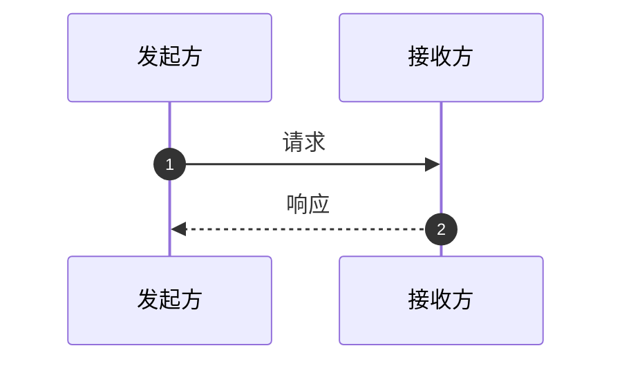
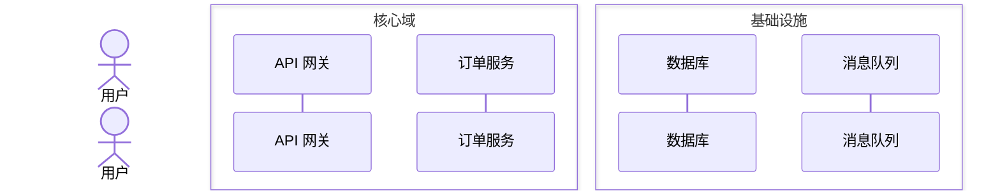
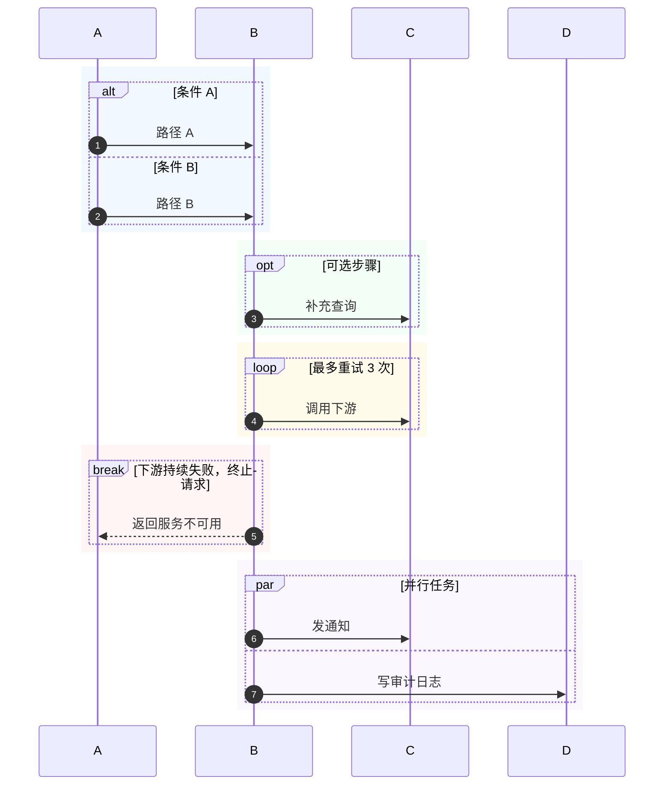
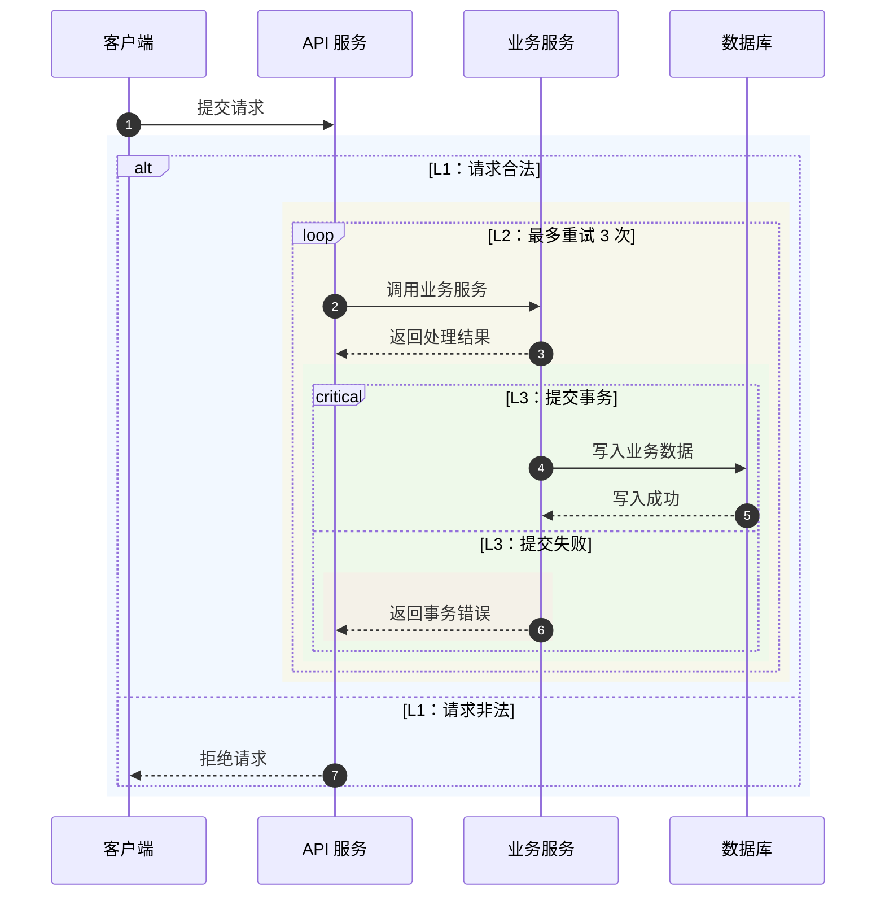
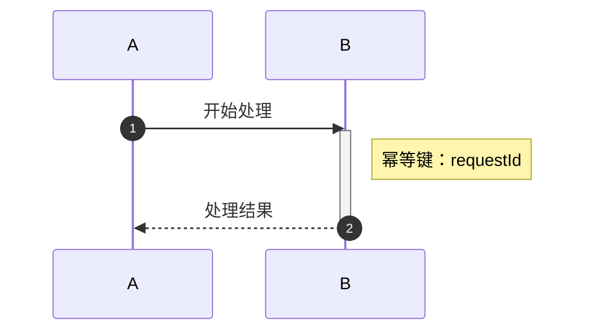

# Mermaid 时序图语法参考

## 基础骨架

`sequenceDiagram` 必须是第一条有效语句，`autonumber` 必须是第二条有效语句。参与者可在首次消息中隐式创建，但正式交付时建议显式声明，便于控制顺序、别名和角色类型。禁止在消息文本中手写序号代替自动编号。

## 参与者和分组

`box` 的标题应短。无颜色时使用 `box 核心域`；需要颜色时使用 `box Aqua 核心域`，颜色必须位于标题之前。如果目标渲染器对分组支持不一致，删除 `box` 不应改变业务语义。

## 箭头速查

| 写法 | 适用语义 |
| --- | --- |
| `->>` | 实线请求/调用，常用于同步调用 |
| `-->>` | 虚线返回/响应 |
| `-)` | 实线开放箭头，常用于异步投递 |
| `--)` | 虚线开放箭头，常用于异步投递 |
| `--x` | 虚线丢失/未送达，需在文本中解释原因 |
| `-x` | 实线丢失/失败，需谨慎使用 |

箭头样式不是业务事实本身。始终在消息文本中写“异步投递”“超时”“未送达”等关键语义，并确认渲染器版本支持所选写法。

## 控制块

控制块标题写成“条件/次数/退出条件”，避免只写“情况一”“处理”。`critical`、`break` 只在确有关键区或提前终止语义时使用。

异常、失败或终止区域在红色 `rect` 前写 `%% semantic:exception`；兜底、降级或重试区域在黄色 `rect` 前写 `%% semantic:fallback`。注释不显示在图中，但让静态校验器能够检查语义配色。若黄色重试最终耗尽，应另起红色区域表达最终失败。

## 多区域块与嵌套

同一张图存在多个逻辑块，或 `alt`、`opt`、`loop`、`par`、`critical`、`break` 相互嵌套时，为每个逻辑块单独增加 `rect`。嵌套标题按 `L1`、`L2`、`L3` 标层级，相邻层和同级块使用不同的低饱和度颜色。

闭合顺序必须由内到外：先关闭 `critical`，再关闭它的 `rect`；然后依次关闭 `loop` / `rect`、`alt` / `rect`。`box` 仅分组参与者，不用于给上述嵌套逻辑着色。超过三层时拆成总览图和子流程图。

## 激活和注释

激活条必须有对应的 `deactivate`；嵌套调用时按实际处理范围闭合。注释适合放假设、状态和约束，不要把第二条业务消息藏进注释。

## 复杂图的拆分策略

1. 总览图只保留跨系统边界的 5–12 个关键消息。
2. 认证、库存、支付、补偿等复杂子流程单独成图，并在总览图中用一条消息表示入口/出口。
3. 对同一参与者超过约 20 条消息、控制块达到三层且内容较多、超过三层或横向参与者超过约 8 个时，优先拆图；超过三层必须拆图。
4. 拆图后沿用同一参与者命名、协议名称、错误码和编号规则。

## 常见渲染问题

- 消息或注释中的小写 `end` 可能破坏解析：改用括号、方括号、引号或实体编码包裹。
- 消息文本中的分号会被当成语句分隔符：需要显示分号时使用 `#59;`。
- `box` 使用 `box 核心域` 或 `box Aqua 核心域`，不要给标题额外加引号，否则部分渲染器会把引号作为标题文字显示。
- `alt`、`loop`、`par` 缺少 `end`：按缩进逐块配对。
- 多个或嵌套逻辑块难以辨认：为每个逻辑块增加独立 `rect`，并检查同级/相邻层颜色和层级标题是否重复。
- 参与者别名包含特殊字符：将显示文本放在 `as` 后，内部别名使用字母、数字或下划线。
- 目标平台 Mermaid 版本较旧：优先使用 `participant`、`->>`、`-->>`、`alt`、`loop` 等基础语法，减少样式和新箭头。
